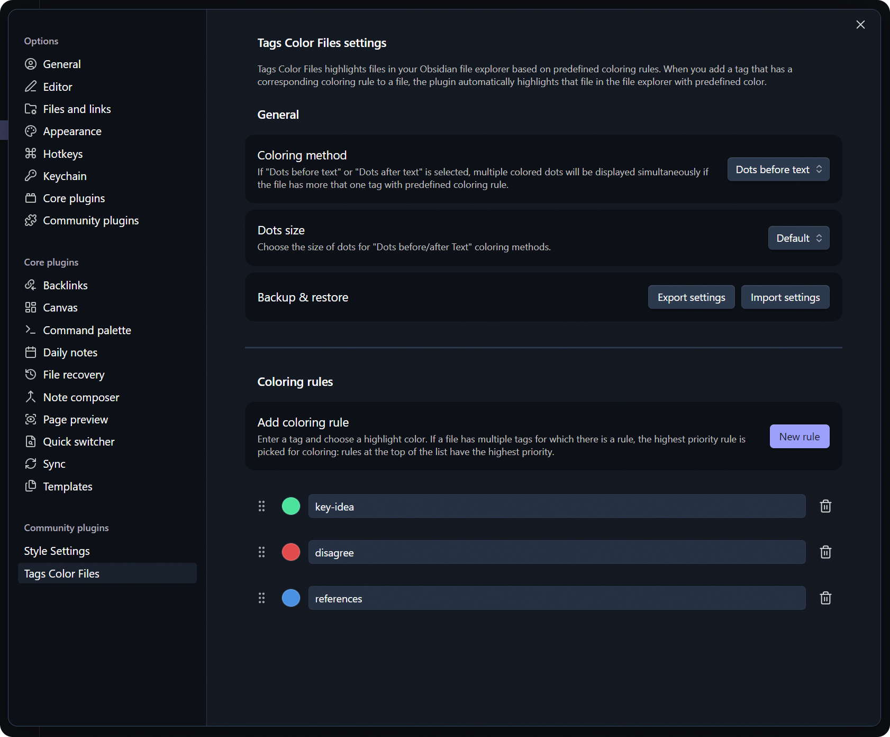

# Tags Color Files Plugin

English | [Русский](https://github.com/pan4ratte/obsidian-tags-color-files/blob/main/README_RU.md)

This plugin allows you to automatically highlight files in your Obsidian explorer with different colors based on the tags they contain. File colors are determined by rules that you create in the plugin settings by entering a tag and assigning a color to it. After adding a tag for which a rule has been created to a file, that file is colored accordingly in the Obsidian explorer.

## Features

1. Automatic file highlighting in the Obsidian file explorer based on the tag-color rules that you create.

2. Tag prioritization in the plugin settings. Useful for cases, when a single file contains more than one tag for which coloring rule was created. The plugin will select the tag with the highest priority to color that file.

3. Coloring method choices: not only basic ones, like "Text" and "Background", but also advanced, such as "Dots before/after text" and "Dots before/after text + text". Choice of the dots sizes is also available. When you choose advanced options, up to three colored dots are displayed simultaneously in the file explorer if a single file contains multiple tags for which coloring rules have been created.

4. Export and import of plugin settings to a file.

5. Localization support. Currently available languages: English and Russian.

## Plugin Use Case

Initially, the plugin was created for my personal needs. When reading literature, I tag certain quotes with such tags as `#key-idea` or `#disagree` to highlight relevant thoughts. It would be more convenient for me to see such quotes in the Obsidian explorer without having to filter notes by tags in the search bar or in the tag pane. — This plugin solves exactly that problem, but I can imagine that there could be much more creative use cases for it.

## How to Install the Plugin Before it Appears in the Official Obsidian Plugin Store

1. Install the `BRAT` plugin from the official Obsidian plugin store.

2. In the `BRAT` settings, find the “Beta plugin list” section and click on the “Add beta plugin” button.

3. In the window that appears, paste the link to the `Tags Color Files` plugin repository: [https://github.com/pan4ratte/obsidian-tags-color-files](https://github.com/pan4ratte/obsidian-tags-color-files)

4. Under “Select a version,” choose “Latest version” and click the “Add plugin” button.

Done! The plugin will automatically install and will be ready to use.

## Contributions and Roadmap

I am open to suggestions and new ideas that expand the plugin's functionality. Below are some ideas for new features and updates — some of them I cannot implement myself (I'm not a programmer), but they would be huge quality of life improvements:

- [ ] Visual enhancement of all dots coloring methods. Currently I am not completely satisfied with their integration into the Obsidian's interface. They should be updated to avoid conflicts with other interface elements.

- [ ] Export option on mobile devices. For now, it is available only on desktop and was deleted from mobile devices because I could not make it work.

- [x] ~~Plugin optimization for Obsidian mobile.~~

- [x] ~~Error message if the user inputs a tag with invalid formatting when creating a new coloring rule.~~

- [x] ~~Prevention of creation of two rules for the same tag.~~

- [x] ~~Suggestions of existing tags while creating a new rule.~~

- [x] ~~An option to choose between three sizes for "Dots ..." coloring methods: default, smaller, bigger.~~

### Knows Bugs

- [x] ~~Under certain conditions, dragging and dropping a tag might result in deletion of that tag from the plugin database.~~

## About the Author

My name is Mark Ingram (Ingrem), I am a Religious Studies scholar. Apart from my main area of study (Protestant Political Theology in Russia), I teach the subject "Information Technologies in Scientific Research", a unique course that I developed myself from scratch. This plugin helps me in my studies and I use it in my teaching. Hello to every student that came across this page!