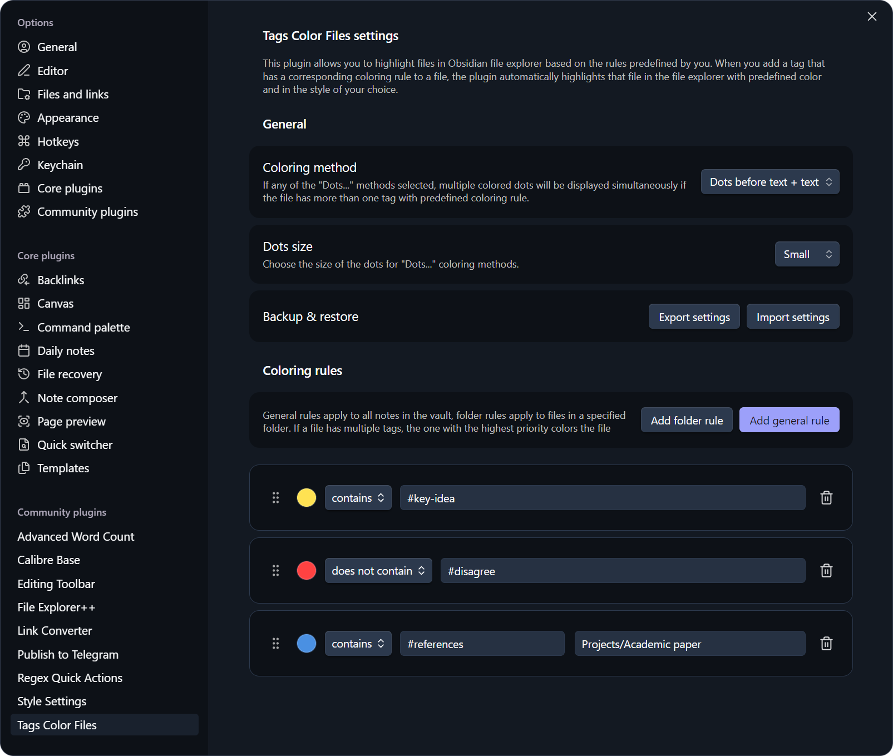

# Плагин Tags Color Files

[English](https://github.com/pan4ratte/obsidian-tags-color-files/blob/main/README.md) | Русский

Данный плагин позволяет автоматически выделять файлы в вашем проводнике Obsidian разными цветами на основании имеющихся в них тегов. Цвета файлов определяются правилами, которые вы создаёте в настройках плагина, вводя тег и присваивая ему цвет. После добавления к файлу тега, для которого создано правило, этот файл окрашивается в соответствующий цвет в проводнике Obsidian.

## Фичи

### 1. Автоматическое выделение файлов в проводнике

Файлы окрашиваются в проводнике Obsidian на основании правил типа тег-цвет, которые вы создаёте. Достаточно добавить к заметке тег, для которого создано правило, и плагин сразу же применит цвет. По умолчанию правила окрашивают заметки с указанным тегом, но возможно также негативное выделение файлов, не содержащих указанный тег. Наконец, кроме общих правил можно задавать правила папок, чтобы подсвечивать заметки только внутри выбранной папки.

### 2. Шесть методов окрашивания

Доступны как базовые способы "Текст" и "Фон", так и более сложные "Точки перед/после текста" и "Точки перед/после текста + текст". При выборе любого из способов с точками в проводнике одновременно отображается до трёх цветных точек, если в одном файле содержится несколько тегов, для которых создано правило окрашивания. Также, доступна настройка размеров цветных точек.

### 3. Приоритизация тегов

Правила упорядочиваются в настройках плагина перетаскиванием или стрелками. Если в одном файле содержится больше одного тега, для которого создано правило окрашивания, плагин окрасит такой файл по правилу с наибольшим приоритетом.

### 4. Окрашивание файлов в Bases

Опционально можно включить окрашивание в Bases в представлениях "Таблица" и "Список". Окрашивается только текст имени файла, независимо от выбранного способа окрашивания.

### 5. Резервное копирование и восстановление

Все ваши правила можно экспортировать и импортировать в плагин. Экспорт доступен только на компьютерах из-за ограничений мобильных платформ.

## Кейс использования плагина

Изначально, плагин был создан для моих личных нужд. При чтении литературы я помечаю некоторые цитаты тегами по типу `#ключевое` или `#не-согласен`, когда хочу выделить соответствующие мысли. Мне было бы более удобно видеть такие цитаты в проводнике Obsidian без необходимости фильтровать заметки в строке поиска или в панели тегов. — Именно эту проблему решает данный плагин, но я могу представить себе и другие намного более творческие способы его использования.

## Установка

### Вариант 1: Магазин плагинов Obsidian

1. Находясь в настройках Obsidian, откройте вкладку "Сторонние плагины" и нажмите на кнопку "Обзор".

2. В поисковой строке введите `Tags Color Files`, нажмите на результат, затем на кнопки "Установить" и "Включить".

Альтернативно, вы можете установить плагин, перейдя на сайт сообщества по ссылке: [https://community.obsidian.md/plugins/tags-color-files](https://community.obsidian.md/plugins/tags-color-files)

### Вариант 2: плагин BRAT

Если вы хотите протестировать бета-версию плагина или предыдущие обновления, вы можете сделать это с помощью плагина `BRAT`:

1. Из официального магазина плагинов Obsidian установите плагин `BRAT`.

2. В настройках `BRAT` найдите раздел "Beta plugin list" и нажмите на кнопку "Add beta plugin".

3. В появившемся окне вставьте ссылку на репозиторий плагина `Tags Color Files`: [https://github.com/pan4ratte/obsidian-tags-color-files](https://github.com/pan4ratte/obsidian-tags-color-files)

4. В пункте "Select a version" выберите нужную версию и нажмите на кнопку "Add plugin". Плагин автоматически установится и будет готов для использования.

## Об авторе

Меня зовут Марк Ингрэм, я религиовед, и кроме своего основного направления исследований (протестантская политическая теология в России), я преподаю предмет "Информационные технологии в научных исследованиях" на основании своей собственной уникальной программы. Данный плагин помогает мне в исследованиях, а также я использую его в преподавании, как и другие плагины, которые я разрабатываю и которые вы можете найти в моём профиле на GitHub.

Привет всем студентам, которые зашли на эту страницу!
